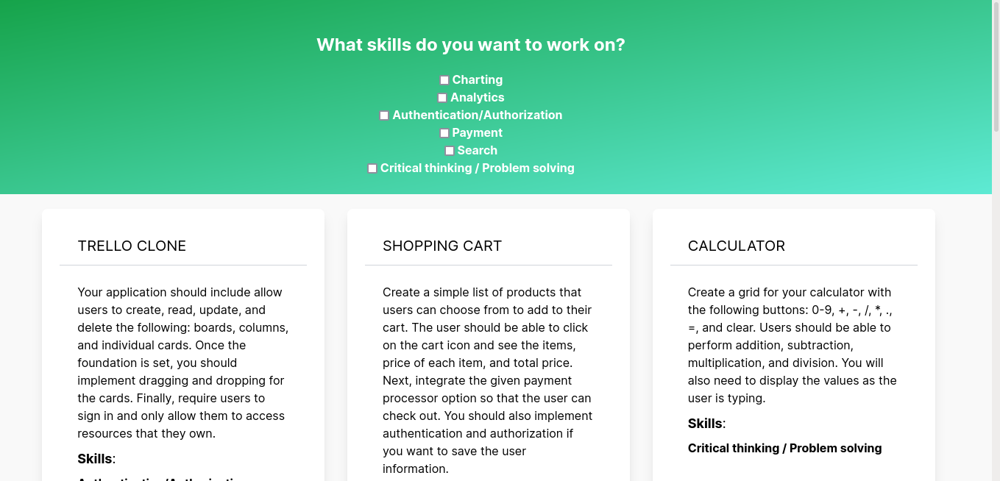

# Project-Idea-Generator

<center></center>

This app was made in order to understand better the differences between Vue's Options API and Composition API.

I made some small changes, like using Tailwind instead of Bulma for my CSS.

## Running the application

Firstly, clone the repository and go to its directory.

Then, install the dependencies and run the project:

```bash
yarn install
yarn serve
```
Now, you need to clone the API provided to this project and run it.

[Express API repo](https://github.com/auth0-blog/app-generator-api):

```bash
git clone git@github.com:auth0-blog/app-generator-api.git
cd app-generator-api
npm install
nodemon server.js
```
